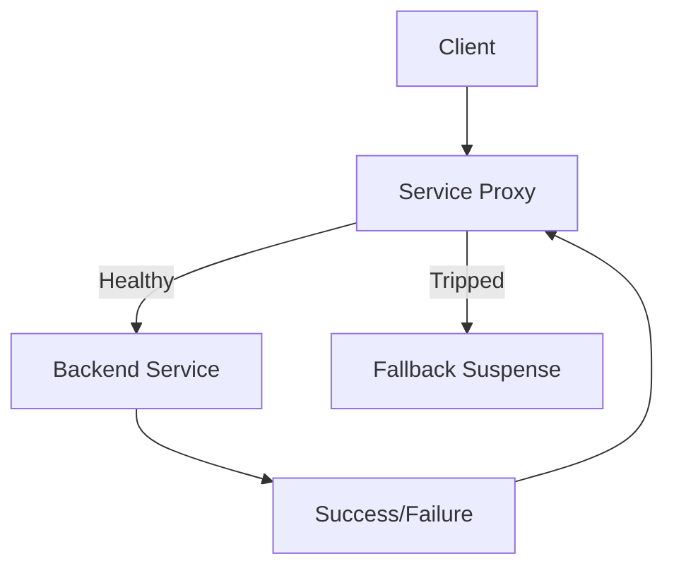

# Circuit Breaker

## Summary
Temporarily blocks calls to a failing service to prevent cascading failure and allows for recovery. 

---

## Context
In microservices or distributed systems, repeated failures in dependent services can lead to system-wide issues.

## Problem
Repeated retries on a failing downstream service increase load and latency for users.

## Solution
Use a circuit breaker to track failures and "trip" the breaker when failures cross a threshold. During this time, short-circuit requests or return fallback responses.

## Diagram

## Trade-offs
- **Pros**: Improves fault isolation, prevents system collapse
- **Cons**: May require tuning thresholds; adds complexity

## When Not to Use
- When downstream systems are critical and no fallback is acceptable
- In small monolithic apps

## Related Patterns
- Retry
- Bulkhead
- Timeout

## Blueprint
<!-- Dead link: ../../blueprints/terraform/circuit-breaker/main.tf -->

## References
- [Martin Fowler on Circuit Breaker](https://martinfowler.com/bliki/CircuitBreaker.html)
- [AWS Resilience Patterns](https://docs.aws.amazon.com/)