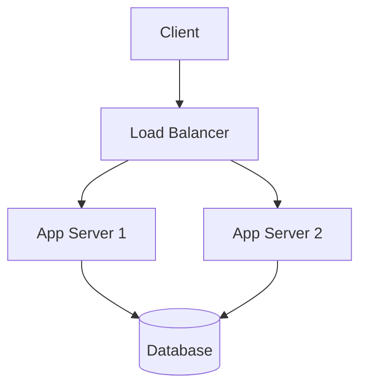

# Horizontal Scaling

## Summary
Increase system capacity by adding more instances of components (like web servers, databases) rather than increasing the capacity of a single instance.

## Context
Used in distributed systems where workloads increase beyond the capacity of a single machine.

## Problem
Vertical scaling (adding more CPU/RAM to a single machine) has limits and can become a single point of failure.

## Solution
Distribute load across multiple machines using load balancers and stateless service instances.

## Diagram

## Trade-offs
- ✅ Easier to scale elastically
- ✅ Improves fault tolerance
- ❌ More complex to manage
- ❌ Needs stateless architecture or shared storage/session handling

## When Not to Use
- When systems are monolithic or stateful and cannot be easily distributed.

## Related Patterns
- Load Balancer
- Service Discovery
- Stateless Services

## Blueprint
<!-- Dead link: ../../blueprints/terraform/horizontal-scaling.tf -->

## References
<!-- Dead link: https://aws.amazon.com/architecture/scalability/ -->
- [Google Cloud Load Balancing](https://cloud.google.com/load-balancing)
